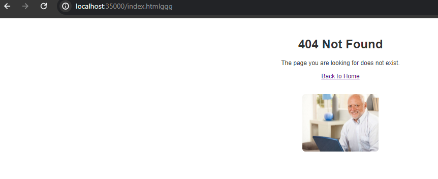
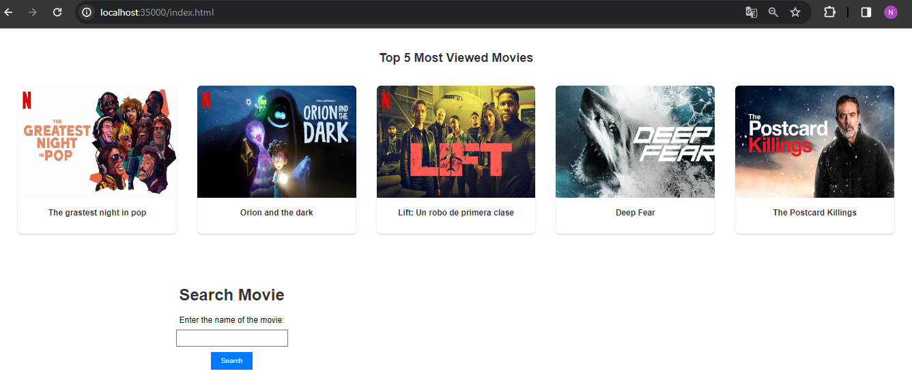
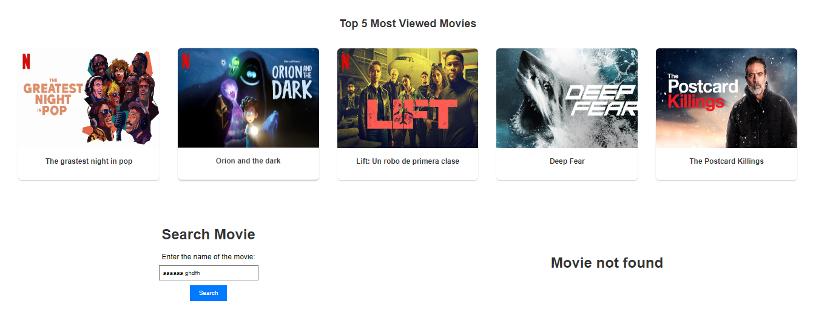
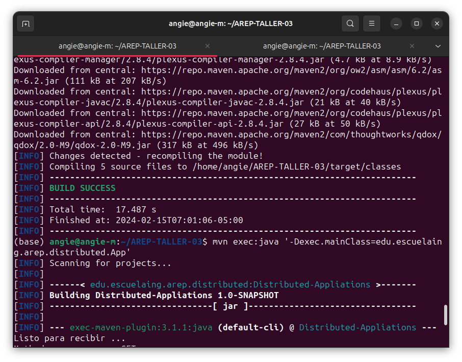
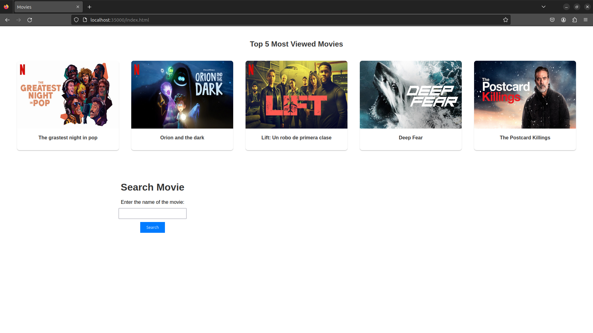

# Taller 3: Microframeworks WEB

El objetivo del taller es construir una aplicación para consultar la información de películas de cine. La aplicación recibirá una frase de búsqueda del título, por ejemplo “Guardians of the galaxy” y deberá mostrar los datos de la película correspondiente. A su vez, el servidor servidor web debe soportar múlltiples solicitudes seguidas (no concurrentes). El servidor debe leer los archivos del disco local y retornar todos los archivos solicitados, incluyendo páginas html, archivos java script, css e imágenes.

Para lo anterior, se utilaza el API gratuito de [OMBd](https://www.omdbapi.com/).

En este taller usted debe explorar la arquitectura del microframework WEB denominado sparkweb (https://sparkjava.com/). Este micro framework permite construir aplicaciones web de manera simple usando funciones lambda, y permitir onfigurar el directorio de los archivos estáticos, y cambiar el tipo de la respuesta a "application/json".

## Iniciando

Estas instrucciones le permitirán obtener una copia del proyecto en funcionamiento en su máquina local para fines de desarrollo y prueba.

### Prerequisitos

Qué cosas se necesitan para ejecutar el software.

* Git
* Maven
* Java

### Instalación	y ejecución

A continuación se presentan los pasos para obtener una copia del proyecto en funcionamiento en su máquina local.

* Clonar el proyecto
    ```bash
    git clone https://github.com/An6ie02/AREP-TALLER-03.git
    cd AREP-TALLER-03
    ```
* Compilar el proyecto
    ```bash
    mvn clean compile
    ```
* Ejecutar el proyecto
    ```bash
    mvn exec:java '-Dexec.mainClass=edu.escuelaing.arep.distributed.App'
    ```
* Diríjase a su navegador de preferencia y vaya a la siguiente dirección: [http://localhost:35000/index.html](http://localhost:35000//index.html) para ver la aplicación en funcionamiento, como se muestra a continuación:

    Página resultante de ingresar a [http://localhost:35000/](http://localhost:35000/)\
    \
    Página principal de la búsqueda.\
    \
    Página resultante de buscar la película "It".\
    \
    Caso en el que la película no existe o no se encuentra.\
    

#### Probando en Linux

Se realiza el mismo procedimiento para clonar y ejecutar el proyecto y el resultado se ve como se muestra a continuación:



El acceso a la aplicación



## Ejecutando las pruebas

Para ejecutar las pruebas, corra el siguiente comando:

```bash
mvn test
```
Las pruebas realizadas incluye el caso en que se hace get de un recurso como el index.html, y el servidor responde con el archivo solicitado. También se incluye los casos en que no existe el recurso solicitado, y el servidor responde con un error 404. 

## Documentación

Para generar la documentación de la aplicación, debe ejecute el siguiente comando.

```bash
mvn javadoc:javadoc
```
El anterior comando crea un archivo con la documentación de la aplicación, esta la puede encontrar en `./target/site/apidocs/index.html`.

## Arquitectura de la aplicación

Esta aplicación se compone de dos clases principales, `App` y `HttpClient`. La primera es la encargada de manejar las peticiones del cliente, y la segunda es la encargada de realizar la consulta a la API de OMDb.

Usa caché para almacenar las consultas realizadas, de manera que si se vuelve a realizar la misma consulta, no se hace la petición a la API, sino que se retorna la información almacenada en caché.

Se utilizó el microframework web para la creación del servidor web, el cual se encarga de manejar las peticiones del cliente y responder con la información solicitada.

El patrón de diseño utilizado es el patrón de diseño Singleton, el cual se encarga de garantizar que una clase tenga una única instancia y proporcionar un punto de acceso global a ella.

## Construido con

* [Maven](https://maven.apache.org/) - Administrador de dependencias
* [OMDAPI](https://www.omdbapi.com) - API externa de consulta
* [Documentation: Reading, Writing, and Creating Files](https://docs.oracle.com/javase/tutorial/essential/io/file.html) - Documentación de Java para lectura y escritura de archivos

## Autor

* **Angie Natalia Mojica** [Angie Natalia Mojica](https://www.linkedin.com/in/angienataliamojica/)

## Agradecimientos

* Al profesor [Luis Daniel Benavides Navarro](https://www.linkedin.com/in/danielbenavides/) por la guía y la enseñanza en el curso de Arquitecturas Empresariales.
